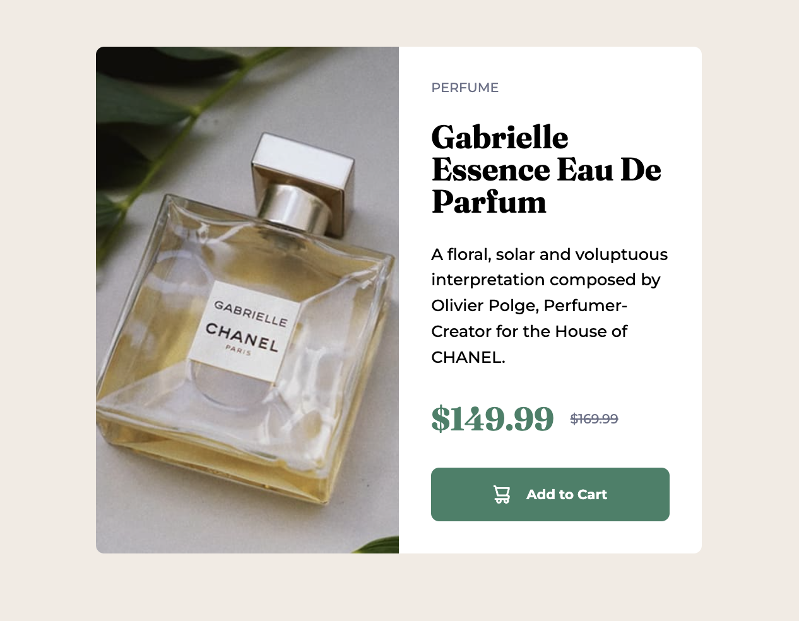

# Frontend Mentor - Product preview card component solution

This is a solution to the
[Product preview card component challenge on Frontend Mentor](https://www.frontendmentor.io/challenges/product-preview-card-component-GO7UmttRfa).
Frontend Mentor challenges help you improve your coding skills by building
realistic projects.

## Table of contents

- [Overview](#overview)
  - [The challenge](#the-challenge)
  - [Screenshot](#screenshot)
  - [Links](#links)
- [My process](#my-process)
  - [Built with](#built-with)
  - [What I learned](#what-i-learned)
  - [Continued development](#continued-development)
  - [Useful resources](#useful-resources)
- [Author](#author)

## Overview

### The challenge

Users should be able to:

- View the optimal layout depending on their device's screen size
- See hover and focus states for interactive elements

### Screenshot



### Links

- Solution URL:
  [Repo](https://github.com/kmje405/fem-product-preview-card-component)
- Live Site URL:
  [Live Site](https://fem-product-preview-card-kmje405.netlify.app/)

## My process

### Built with

- Semantic HTML5 markup
- CSS custom properties
- Flexbox
- Mobile-first workflow
- Custom font loading with @font-face
- Responsive design with media queries
- CSS calc() functions for precise spacing

### What I learned

This project helped me practice several key frontend development concepts:

**CSS Custom Properties**: I used CSS variables to maintain consistent colors
and fonts throughout the project:

```css
:root {
  --c-black: hsl(212, 21%, 14%);
  --c-grey: hsl(228, 12%, 48%);
  --c-cream: hsl(30, 38%, 92%);
  --c-white: white;
  --c-green-500: hsl(158, 36%, 37%);
  --c-green-700: hsl(158, 42%, 18%);
}
```

**Responsive Typography**: I implemented fluid typography using CSS calc()
functions:

```css
.text-preset-2 {
  font-size: calc(
    0.75rem + (0.875rem - 0.75rem) * ((100vw - 20rem) / (75rem - 20rem))
  );
}
```

**Flexbox Centering**: I learned to properly center content both horizontally
and vertically:

```css
.btn {
  display: flex;
  align-items: center;
  justify-content: center;
  gap: 1rem;
}
```

**Custom Font Loading**: I implemented proper font loading:

```css
@font-face {
  font-family: "Fraunces Bold";
  src: url("./assets/fonts/Fraunces/static/Fraunces_72pt-Bold.ttf") format("truetype");
  font-weight: 700;
  font-display: swap;
}
```

### Continued development

Areas I want to continue focusing on in future projects:

- **Advanced CSS Grid**: While I used Flexbox effectively here, I'd like to
  explore more complex layouts with CSS Grid
- **CSS Animations**: Adding subtle hover animations and transitions to enhance
  user experience
- **Accessibility**: Implementing better focus management and screen reader
  support
- **Performance Optimization**: Exploring font subsetting and image optimization
  techniques

### Useful resources

- [CSS Custom Properties Guide](https://developer.mozilla.org/en-US/docs/Web/CSS/Using_CSS_custom_properties) -
  Helped me understand how to effectively use CSS variables
- [Flexbox Complete Guide](https://css-tricks.com/snippets/css/a-guide-to-flexbox/) -
  Essential reference for flexbox layout techniques
- [Responsive Typography](https://css-tricks.com/snippets/css/fluid-typography/) -
  Great resource for implementing fluid typography with calc()

## Author

- Website - [Kevin Jones-Eastland](https://eastlandjones.com/)
- Frontend Mentor - [@kmje405](https://www.frontendmentor.io/profile/kmje405)
